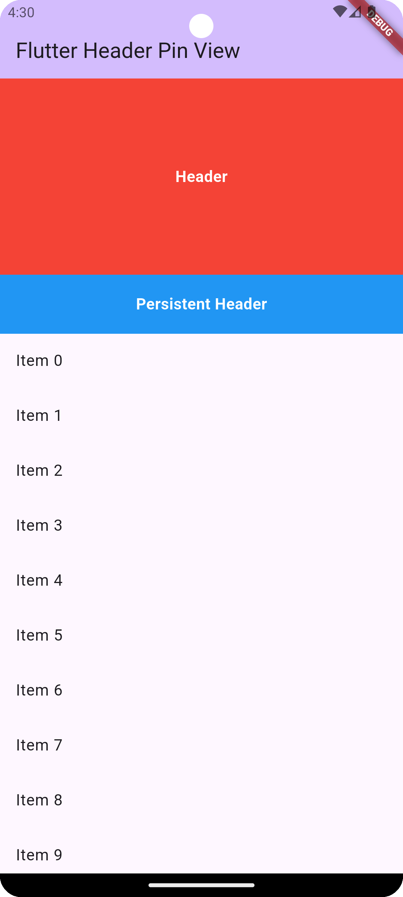
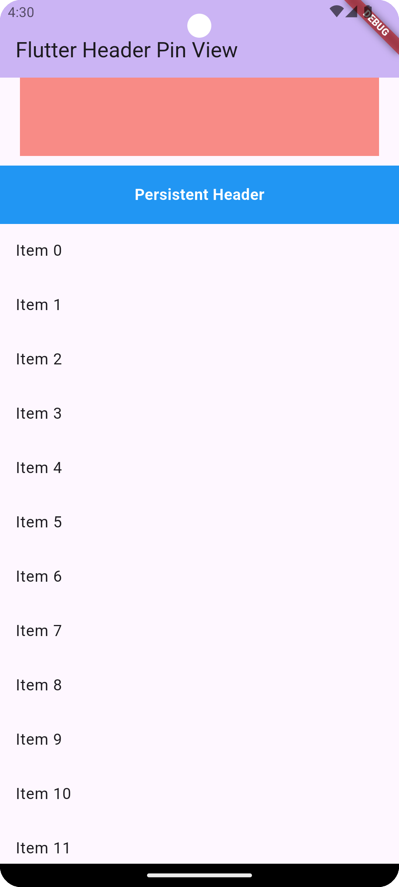
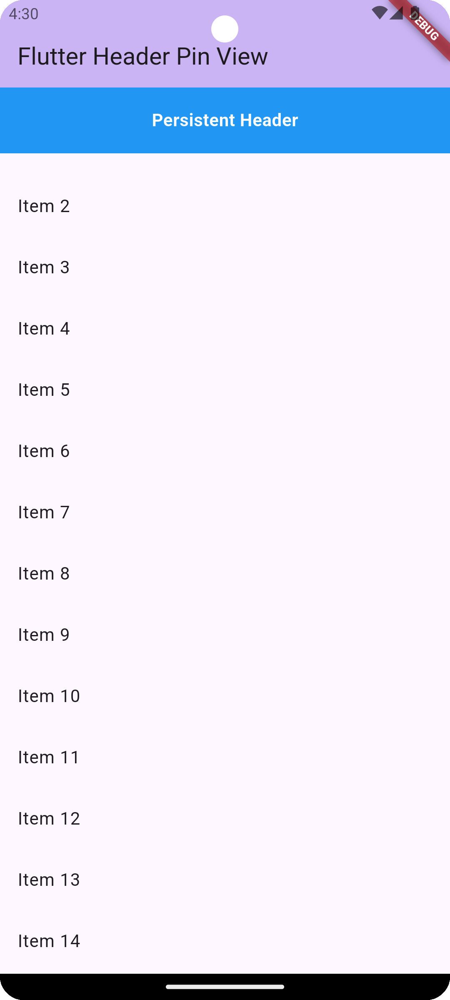

<!--
This README describes the package. If you publish this package to pub.dev,
this README's contents appear on the landing page for your package.

For information about how to write a good package README, see the guide for
[writing package pages](https://dart.dev/tools/pub/writing-package-pages).

For general information about developing packages, see the Dart guide for
[creating packages](https://dart.dev/guides/libraries/create-packages)
and the Flutter guide for
[developing packages and plugins](https://flutter.dev/to/develop-packages).
-->

# Header Pin View

A Flutter package that provides a customizable header pinned view with support for persistent headers and custom body content. This package allows you to create scrollable views with pinned headers that stay at the top while the content scrolls underneath.


## Features

- 📌 Sticky header that pins to the top while scrolling
- 🎨 Customizable header and persistent header widgets
- 📱 Smooth scrolling behavior
- 🎯 Easy to implement and customize
- 🔧 Flexible configuration options

### Screenshots

<p float="left">
  
  
  
</p>

### Demo Video

<video width="100%" controls>
  <source src="screenshots/recording.webm" type="video/webm">
  Your browser does not support the video tag.
</video>

## Getting started

Add this to your package's `pubspec.yaml` file:

```yaml
dependencies:
  header_pin_view: ^1.0.0
```

## Usage

Import the package in your Dart code:

```dart
import 'package:header_pin_view/header_pin_view.dart';
```

Basic usage example:

```dart
HeaderPinnedView(
  headerSliverBuilder: Container(
    height: 200,
    color: Colors.blue,
    child: Center(child: Text('Header Content')),
  ),
  sliverPersistentHeader: Container(
    color: Colors.grey,
    child: Center(child: Text('Pinned Header')),
  ),
  sliverPersistentHeaderHeight: 60,
  body: SingleChildScrollView(
    child: ListView.builder(
      shrinkWrap: true,
      physics: NeverScrollableScrollPhysics(),
      itemCount: 50,
      itemBuilder: (context, index) => ListTile(
        title: Text('Item $index'),
      ),
    ),
  ),
)
```

## Parameters

- `headerSliverBuilder`: The widget to be displayed as the main header
- `sliverPersistentHeader`: The widget to be pinned at the top while scrolling
- `body`: The main scrollable content
- `sliverPersistentHeaderHeight`: Height of the pinned header
- `pinned`: Whether the header should be pinned (default: true)
- `backgroundColor`: Background color of the entire view (optional)

## Additional information

For more examples and detailed usage, check out the `/example` directory in the repository.

For issues and feature requests, please file them on the [GitHub repository](https://github.com/YOUR_USERNAME/header_pin_view/issues).
